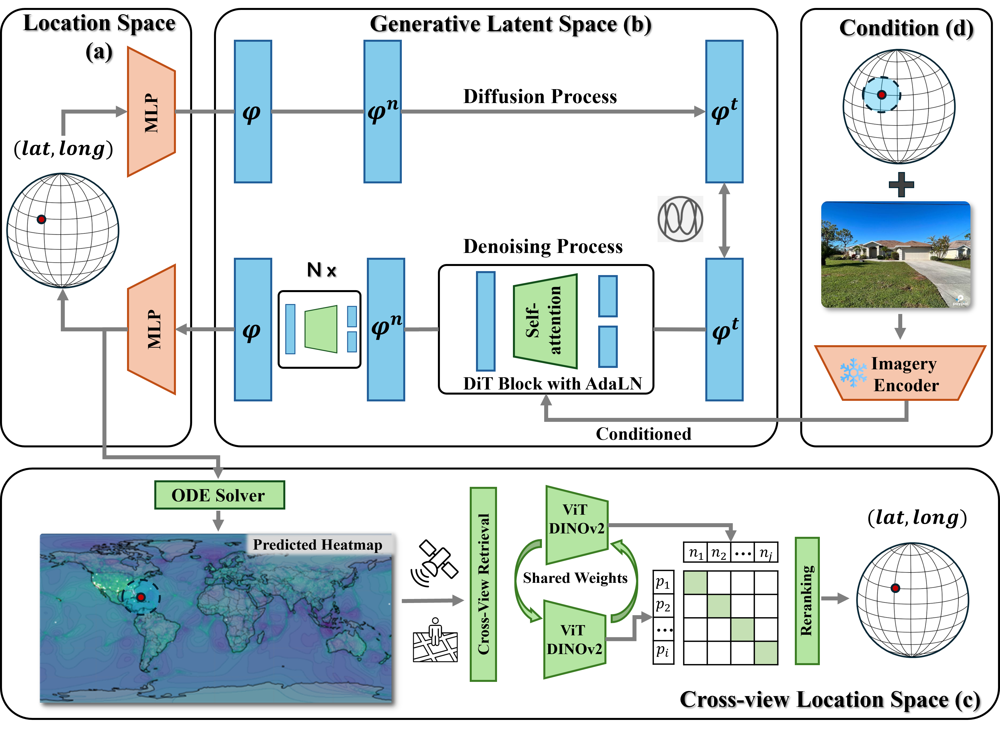

# ProbGLC

### Towards Generative Location Awareness for Disaster Response: A Probabilistic Cross-view Geolocalization Approach

In this paper, we propose **ProbGLC**, a **Prob**abilistic Cross-view **GeoLocali**zation approach 🧭 designed to enable generative location awareness ⚡ for rapid disaster response 🚑

## ⚙️ Installation

From the github repository:
```bash
conda create -n plonk python=3.10
conda activate plonk
pip install -r requirements.txt
pip install -e .
pip install cartopy

```

## 📊 Two Open Datasets

#### 📥 MultiIAN Download Links

- **figshare** 🌐 
  👉 https://doi.org/10.6084/m9.figshare.28238375

<p align="center">
  
</p>

#### 📥 SAGAINDisaster Download Links

- **Google Drive** 🌐  
  👉 https://drive.google.com/file/d/1PVdwLKBsf9JDMnpHbVHA0DpzntfjpgC5/view?usp=sharing

- **Baidu Netdisk - 百度网盘** 🌐  (**Password: 1111**)  
  👉 https://pan.baidu.com/s/1JrKY-2J4_So_6JDYVgNuLg?pwd=1111
<p align="center">
  
</p>

## 🤖 Model

<p align="center">
  
</p>

### Training the model
Download the MultiIAN and the SAGAINDisaster datasets and extract them into: ```plonk/plonk/data/```

To train the ProbGLC model, you can use the following command:

```bash
python plonk/train.py exp=iandisaster20_osm mode=traineval experiment_name=My_IAN_Experiment
```
We have provided multiple configs in the configs/exp/ folder.
For the IAN dataset refer to iandisaster20 or 30 depending on the datasplit, the _osm/_yfcc refers to which pre-trained checkpoint is utilized during training. For the Multidisaster dataset use mulitdisaster20_osm.yaml and so on. When a model has been trained use the ```save_localrepo.py```in the plonk/ folder to save the checkpoint to the huggingface format for model loading. 

### Evaluating the model

We provide two Jupyter Notebooks to evaluate the trained checkpoints as well as the zero-shot performance, namely: 
- DisasterPlonk_IAN.ipynb
- DisasterPlonk_MultiDisaster.ipynb

The trained checkpoints have to be placed in the root folder of the repository.


---
## 📚 Reference
If you find our work useful in your research please consider citing the ProbGLC paper.
```
@article{li2025proglc,
     title={Towards Generative Location Awareness for Disaster Response: A Probabilistic Cross-view Geolocalization Approach},
     author={Hao Li, Fabian Deuser, Wenping Yin, Steffen Knoblauch, Wufan Zhao, Filip Biljecki, Yong Xue and Wei Huang},
     year={2025},
     eprint={},
     archivePrefix={arXiv},
     primaryClass={cs.CV},
     url={},
}
```
Please go to [Dr. Hao Li's Homepage](https://bobleegogogo.github.io/) for more information.

## 📚 Acknowledge 

We would like to sincerely acknowledge and thank the authors of [Plonk](https://github.com/nicolas-dufour/plonk) and [OSV5M](https://osv5m.github.io/). Their incredible work and contributions have greatly inspired and supported our project.
